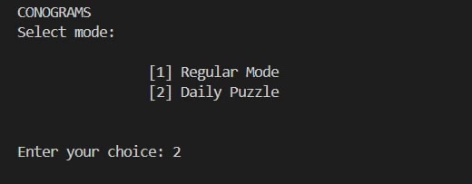
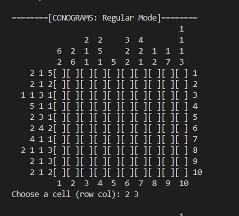
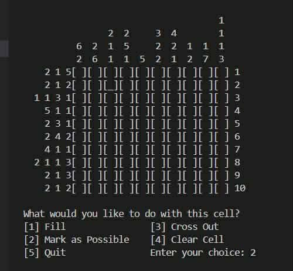
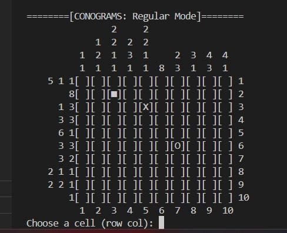

# 🧩 CONOGRAMS - Nonogram Puzzle Game 🧩

A simple, lightweight console-based puzzle game where players take on simple 10x10 nonogram puzzles! (A.K.A. Picross)

It demonstrates the different use of Object Oriented Programming principles such as encapsulation, abstraction, inheritance, and polymorphism. This simple puzzle also contain different approaches like using arrays.

---

## 📌 About 📌

CONOGRAMS is a logic puzzle game where players fill in squares on a 10×10 grid based on numerical hints to reveal a hidden picture. This implementation features randomly generated puzzles, a daily challenge mode with deterministic seeding, and an advanced hint generation system.

**Key Highlights:**
- 10×10 puzzle grid with row and column hints
- Two game modes: Regular and Daily Puzzle
- Multiple cell marking options (Fill, Possible, Cross Out)
- Real-time solution validation

---
## 📁 Project Structure
```
LightYearFinalProject_CS2101/
│
├── Main.java              # Entry point + mode selection menu
├── PuzzleGame.java        # Game flow controller
├── PuzzleLogic.java       # Core puzzle logic & hint generation
│   └── DailyPuzzle        # Daily puzzle subclass (extends PuzzleLogic)
├── InputHandler.java      # Input validation and error handling
└── README.md           
```

## ✨ Features

### Game Modes
- 🧩 **Regular Mode** 🧩- Randomly generated puzzles for endless play
- 🧩 **Daily Puzzle** 🧩 - Unique puzzle each day (same for all players globally)

### Gameplay Features
- ✅ **Hint System** - Row and column numerical hints guide your solving
- 🎨 **Multiple Marking Types**:
  - Fill (■) - Mark confirmed cells
  - Possible (O) - Mark cells you think might be filled
  - Cross Out (X) - Eliminate cells you know are empty
  - Clear - Remove any mark
- 🔍 **Cell Highlighting** - Preview selected cell before marking
- 🏆 **Auto Win Detection** - Automatically validates when puzzle is solved
- 🎯 **Flexible Validation** - Only filled cells count toward solution

### Technical Features
- 📊 Input validation and error handling
- 🌍 Daily puzzles 
- 🎨 Clean console interface with grid numbering
- ⚡ Efficient hint generation algorithm

---

## 🎲 How to Play

### Objective
Use the numerical hints on the rows and columns to determine which cells should be filled to reveal the hidden pattern!

### Understanding Hints
```
Row hints:     3 2 1     means "3 consecutive, then 2 consecutive, then 1"
Column hints:  5         means "5 consecutive filled cells"
               0         means "no filled cells in this row/column"
```

### Example Puzzle
```
Hints:           Column hints
              3   1 2   4 1
              ↓   ↓ ↓   ↓ ↓
         2 1 [■][ ][■][ ][ ]  ← Row hint: 2, 1
           3 [■][■][■][ ][ ]  ← Row hint: 3
         1 1 [ ][■][ ][■][ ]  ← Row hint: 1, 1
```

### Winning
Match all filled cells (■) to the solution. Marks like O and X are ignored in validation - they're just helpers for your strategy!

---

### Setup & Run

1. **Download/Clone the project**
```bash
   cd LightYearFinalProject_CS2101
```

2. **Compile all Java files**
```bash
   javac *.java
```

3. **Run the game**
```bash
   java Main
```

4. **Select your mode**
```
   CONOGRAMS
   Select mode:
   
       [1] Regular Mode
       [2] Daily Puzzle
   
   Enter your choice:
```

---

## 🎮 Game Modes

### 1. Regular Mode
- **Infinite Play**: Generate new random puzzles
- **Balanced Difficulty**: ~60% fill rate for optimal challenge
- **Perfect for Practice**: Learn strategies without pressure

### 2. Daily Puzzle
- **One Puzzle Per Day**: Same puzzle for everyone worldwide
- **Consistent Experience**: Play, quit, and resume - same puzzle all day!
- **Community Challenge**: Compare solutions with friends

---

## 🎮 Controls & Marking System

### Selecting a Cell
```
Choose a cell (row col): 5 7
```
- First number: Row (1-10)
- Second number: Column (1-10)

### Marking Options

After selecting a cell, choose an action:

| Option | Symbol | Purpose | Counts for Solution? |
|--------|--------|---------|---------------------|
| **[1] Fill** | ■ | Mark as definitely filled | ✅ Yes |
| **[2] Mark as Possible** | O | Maybe filled (your note) | ❌ No |
| **[3] Cross Out** | X | Definitely NOT filled | ❌ No |
| **[4] Clear Cell** | (empty) | Remove any mark | - |
| **[5] Quit** | - | Exit to menu | - |

### Strategy Tips
- Use **O** to mark cells you're unsure about
- Use **X** to eliminate cells you know are empty
- Only **■** marks are validated against the solution
- Cross-reference row and column hints to deduce cells

---

### Class Descriptions

#### **Main.java**
- Displays mode selection menu
- Validates user input (1 or 2)
- Instantiates PuzzleGame with selected mode

#### **PuzzleGame.java**
- Controls game loop for both modes
- Handles user interactions (cell selection, marking)
- Manages quit functionality
- Calls appropriate PuzzleLogic methods

#### **PuzzleLogic.java**
Core puzzle functionality:
- `createPuzzle()` - Generates random puzzle solution
- `newInstance()` - Initializes empty user grid
- `genHintRows()` / `genHintCols()` - Generates numerical hints
- `displayInstance()` - Renders grid with hints
- `displayInstanceHighlighted()` - Shows selected cell preview
- `compareAnswer()` - Validates user solution
- `setCell()` - Updates cell with user's mark

**Key Data Structures:**
```java
int Solution[][]        // The correct answer (10×10)
int puzzleInstance[][]  // User's current marks (10×10)
List<Integer> hintNumRow/Col  // Generated hint numbers
```

#### **DailyPuzzle.java** (extends PuzzleLogic)
- Overrides `createPuzzle()` with date-based seeding
- Uses `LocalDate` and `DateTimeFormatter` for date handling
- Generates deterministic puzzles based on current date

#### **InputHandler.java**
- `getValidateInput()` - Gets integer input with exception handling
- `intValidation()` - Validates input within bounds
- Handles `InputMismatchException` gracefully

---

## 🔧 Technical Highlights

### 1. **Hint Generation Algorithm**
The game analyzes the solution grid and generates numerical hints:
```java
// For each row/column:
// Count consecutive filled cells
// Store counts in order
// Display right-aligned with spacing
```

**Example:**
```
Solution row: [1][1][1][0][1][1][0][0][0][1]
Hint:              3     2           1
```

### 2. **Daily Puzzle Seeding**
```java
// Get current date
LocalDate date = LocalDate.now();
DateTimeFormatter formatter = DateTimeFormatter.ofPattern("DDD");
String dateString = date.format(formatter);

// Create seed: day-of-year + year
long dateLong = Integer.parseInt(dateString) + Year.now().getValue();

// Use seed for Random
Random rand = new Random(dateLong);
```

### 3. **Flexible Solution Validation**
```java
// Only cells marked with Fill (1) are checked
// Possible (2) and Cross Out (3) marks are ignored
if (puzzleInstance[i][j] > 1) {
    compPuzzle[i][j] = 0;  // Treat as empty for validation
}
```

This allows players to use helper marks without affecting the solution.

### 4. **Input Validation**
```java
try {
    int val = scanner.nextInt();
    return val;
} catch (InputMismatchException e) {
    System.out.print("Invalid input, please try again: ");
    scanner.next(); // Discard invalid token
    return -1;
}
```

Prevents crashes from non-numeric input.

---

## 🏗️ OOP Concepts

This project demonstrates key Object-Oriented Programming principles:

### 1. **Inheritance**
```java
class DailyPuzzle extends PuzzleLogic {
    @Override
    public void createPuzzle() {
        // Specialized daily puzzle generation
    }
}
```
- `DailyPuzzle` inherits from `PuzzleLogic`
- Overrides `createPuzzle()` for date-based generation
- Reuses hint generation and validation logic

### 2. **Encapsulation**
```java
public class PuzzleLogic {
    protected int Solution[][];        // Protected data
    protected int puzzleInstance[][];  // Hidden from external access
    
    public void setCell(int row, int col, int mark) {
        // Controlled access through public methods
    }
}
```
- Internal data (`Solution`, `puzzleInstance`) is protected
- Public methods provide controlled access
- Data integrity maintained

### 3. **Abstraction**
```java
public void displayInstance() {
    // Complex rendering logic hidden
    // User just calls method - doesn't need to know how
}
```
- Complex operations hidden behind simple interfaces
- Implementation details not exposed

### 4. **Modularity**
- Separate classes for distinct responsibilities:
  - `PuzzleLogic` → Game logic
  - `PuzzleGame` → Game flow
  - `InputHandler` → Input validation
  - `Main` → Menu system

### 5. **Polymorphism**
```java
PuzzleLogic dailyPuzzle = new DailyPuzzle();
dailyPuzzle.createPuzzle();  // Calls DailyPuzzle's version
```
- Same method name, different behavior
- `createPuzzle()` behaves differently for regular vs daily mode

---


## 📝 Documentation and Sample Output

### Hint Display Format
```
          1   2   3   4   5   6   7   8   9   10
          ↓   ↓   ↓   ↓   ↓   ↓   ↓   ↓   ↓   ↓
Row →  2 1[■][ ][■][ ][ ][ ][ ][ ][ ][ ] 1
       3  [■][■][■][ ][ ][ ][ ][ ][ ][ ] 2
```

- Column hints display at top (5 rows for multi-number hints)
- Row hints display on left (up to 9 characters)
- Grid is 10×10 with brackets around each cell
- Row/column numbers on edges for easy reference

### Sample Output

<p align="center">
  
</p>

<p align="center">
  
</p>

<p align="center">
  
</p>

<p align="center">
  
</p>
 

---

### Academic Integrity
This project represents original work by the team members listed above. All code and algorithms are developed specifically for this course.

---
##  👩‍💻 Contributors 👨‍💻

<table>
<tr>
    <th> &nbsp; </th>
    <th> Name </th>
    <th> Role </th>
</tr>
<tr>
    <td></td>
    <td>
        <strong>Rei</strong> <br/>
        <a href="https://github.com/Bunnrei" target="_blank">
            
        </a>
    </td>
    <td>Project Leader</td>
</tr>
<tr>
    <td> </td>
    <td><strong>Yrish</strong> <br/>
    <a href="https://github.com/Yrish-1" target="_blank">
    
        </a>
    </td>
    <td>Member</td>
</tr>
<tr>
    <td> </td>
    <td><strong>Ronjae</strong> <br/>
    <a href="https://github.com/ronjae-calvin-gregorio" target="_blank">
    
        </a>
    </td>
    <td>Member</td>
</tr>
</table>

---
## 🙏 Acknowledgments

- This group would like to express their gratitude to their Object Oriented Programming instructor for guiding and teaching them on how to utilize OOP concepts.  Our gratitude goes to our classmates and peers for their cooperation, and to our families and friends for their patience and constant support; And above all, to the Lord Jesus Christ; the Giver of Life.

---

## 📜 License

This project is created for educational purposes as part of CS2101 coursework.

---

**Enjoy solving! 🧩✨**
